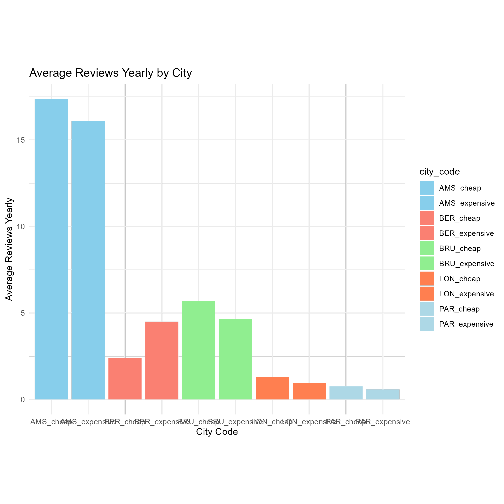

## Introduction

This is a dynamic Rmd document that will briefly analyse the results from this project.
The main goal was to examine the effect that price of a Private room has on the number of reviews. 
In the graph below, we generated the results of 5 capital cities in western Europe to answer the research question. .

## Image


```r
image_path <- '../../gen/analysis/output/bar_chart.png'
image <- readPNG(image_path)
grid.raster(image)
```

<div class="figure">

<p class="caption">plot of chunk display_image</p>
</div>

## Data Summary

From the graph we can tell that in 4 out of the 5 cities we analyzed, the cheaper private rooms have a higher number of yearly average reviews.
Except for Berlin, there we see that the expensive rooms have the upper hand in number of yearly average reviews.
In conclusion, we can say that the yearly average number of reviews for the cheaper rooms is bigger than the yearly average number of reviews of more expensive rooms.

